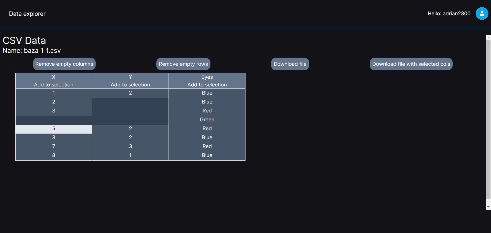
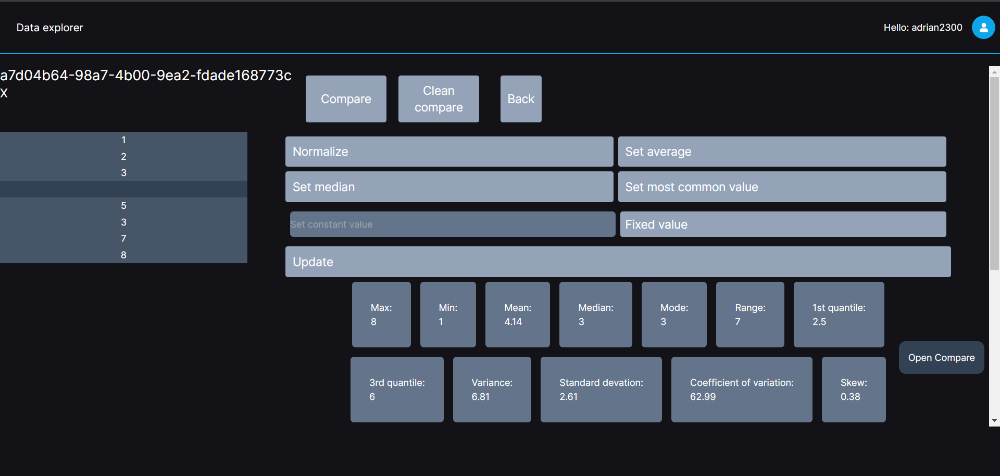
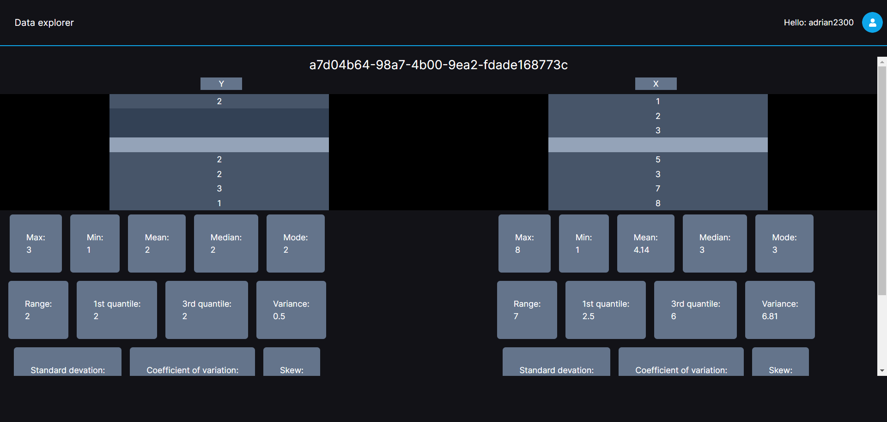

## Description

This is a project designed to meet the requirements outlined at the bottom of the page. In short, the project aims to facilitate the analysis of CSV files.

Source: <a href="https://github.com/MarcinBereta/io_2024">Data explorer</a>

## My Contributions at Work

I've been the lead of the project and the person responsible for the task distribution and their creation.
I've been tasked with creating entire frontend side of the project, with addition of implementing some functionalities on the backend side.
As part of the my work, I've created entire authentication system, all the designs for the application and implemented them on the frontend side.
On the backend side, I've created an mechanism for the csv file transformation, which after sending the csv file from the frontend side to the backend side gathered all the data into the appropriate format. I've been also the main person that was responsible for fixing all the issues that came within the process of the creation of the app.

## App appearance

On the main screen, you can see the loaded CSV file, and you can click on a column, save the entire file, or just individual columns.

  

On the column screen, we see all parameters such as mean, median, etc. We can fill in empty cells or manually change them using the update option.

  

We can also compare two columns, where we get the most important information about them in one place.

  

## Requirements

Project: Application for preliminary data analysis and visualization. Assumptions: Single-stage login. Data is retrieved from CSV files. Number of variables (up to 100). Expected functionalities:

-   Automatic detection of data types with editing capability.
-   Simple variable name changes.
-   Basic 1D EDA descriptive statistics (appropriate to variable type) - expected suggestions.
-   Basic visualizations of a single variable (appropriate to variable type) within a specified time range - expected suggestions.
-   Filling in missing values / correcting outlier values for variables (appropriate to variable type) - expected suggestions (ability to easily return to point 3).
-   Basic measures of dependencies between variables 2D EDA (appropriate to variable types) - expected suggestions.
-   Basic visualizations of two/three variables (appropriate to variable types) within a specified time range - expected suggestions. Additionally:
-   data retrieval by the user (CSV file) from a specified range (variable selection, case selection).
-   ability to save generated plots in jpg and png formats. The output of the application is a "cleaned" data set for further analysis.
