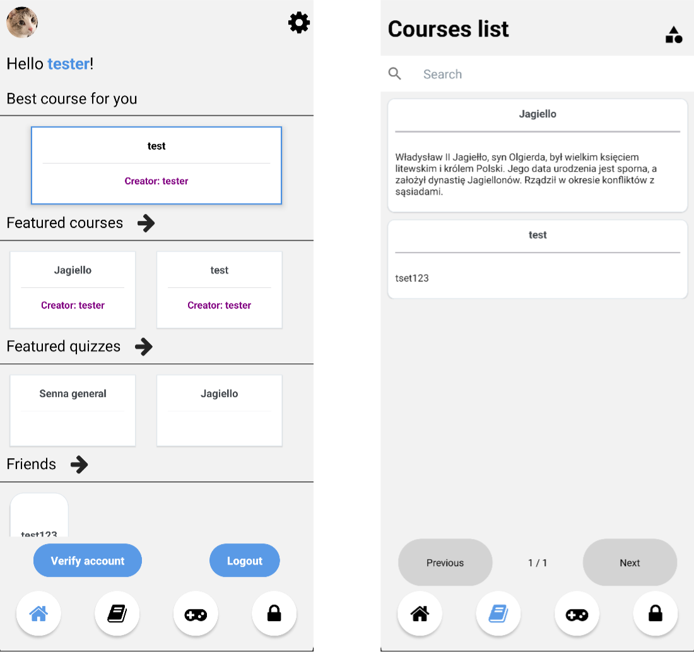
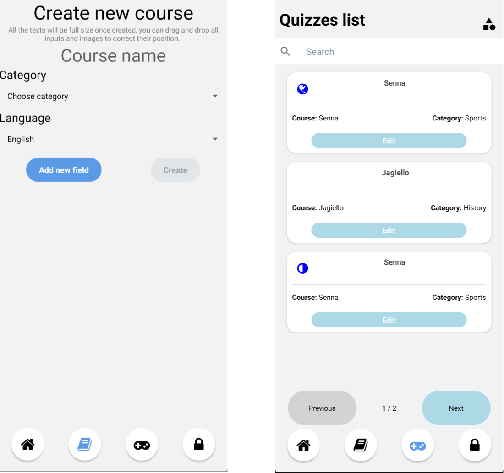
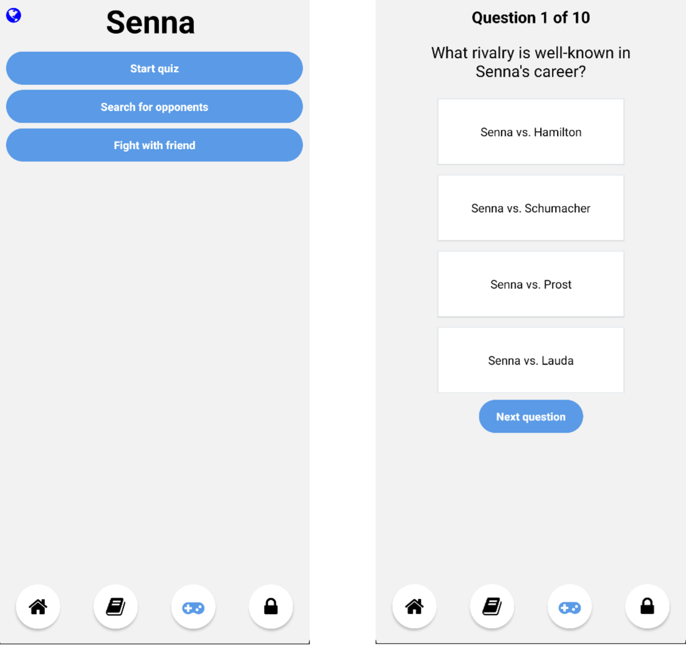

## Description

The engineering thesis was focused on using artificial intelligence to generate quizzes and applying gamification elements to support learning. To this end, a mobile application called QuizGenius was created to automatically generate questions for the text included in the course. This helps content creators to focus on the quality of the delivered content, which is additionally verified by authorized persons. What's more, the application makes it easier for users to select next courses based on previous activities. QuizGenius allows users to test their knowledge by playing quizzes. To increase the pleasure of learning, the possibility to compete with friends, as well as other random players, is provided. Users can track their progress through a system of achievements and statistics, which motivates them to further develop their skills. The engineering thesis was also designed to analyze the usefulness of artificial intelligence in this type of application.

Source: <a href="https://github.com/MarcinBereta/engineering_thesis">Engineering Thesis</a>

Thesis: <a href="../img/thesis/Praca_inżynierska_-_Dokumentacja_-_Bereta_Żerebiec.pdf">
  Enginering Thesis (In Polish)  
</a>

## My Contributions at Work

I was the lead of the project and the person responsible for the task distribution and their creation. I was also the main person that was responsible for fixing all the issues that came within the process of the creation of the app. I created entire authentication system, all the designs for the application and implemented them on the frontend side. I prepared the rivary system for the quizzes, which allowed to connect users and allow them to compete along with other users. I also created a friends system, which allowed users to connect with other users. I build entire communication system between frontend and backend, which was used to send data from the frontend to the backend. Together with the team, I created the course system, which allowed users to share their knowledge with others. I've been also the main person responsible for the modeling of the database and the design of the database schema.

# App appearance

On the main screen, you will be able to see the recommended courses, which are recommended by the system. You can see the most popular courses, which are the most viewed by the users. You can see the quizzes, which are the most viewed by the users.

  

  

  

