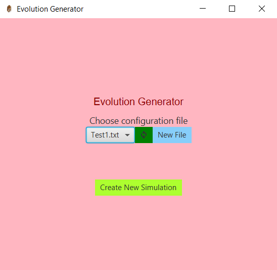
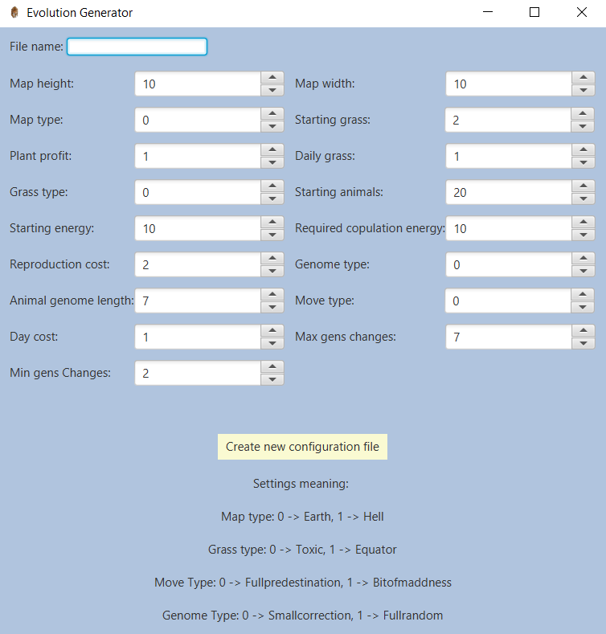
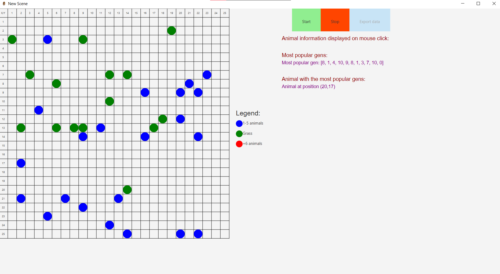

## Description

During the Object-Oriented Programming classes, my colleague and I worked on a project called Evolution Generator.

Project involves creating a simulation of animal evolution in a habitat consisting of steppes and jungles. Animals move, eat plants, reproduce, and evolve based on genes. The simulation also includes various interaction variants between animals and their environment, such as consumption, reproduction, and genetic mutations. The application is to be implemented in JavaFX, allowing users to configure and track simulations, as well as generate statistics.

Source: <a href="https://github.com/MarcinBereta/EvolutionGenerator/settings">EvolutionGenerator/Generator</a>

## App appearance

Our homepage looks as follows, where we can choose a file from which data is to be read, create a new one, or start the simulation.

  

If we want to create a new file with simulation data, the window where this happens looks like this:

  

We can select many parameters in it that affect the simulation.

The simulation itself looks like this, with colors indicating the number of animals in each field.

  

## My Contribution

During the project, I worked on the frontend with JavaFX but also made changes in the backend. It was a somewhat challenging endeavor, but in the end, it worked out.
